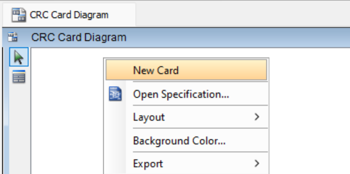
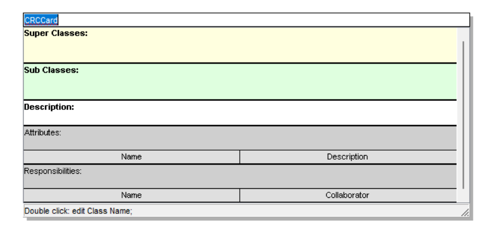
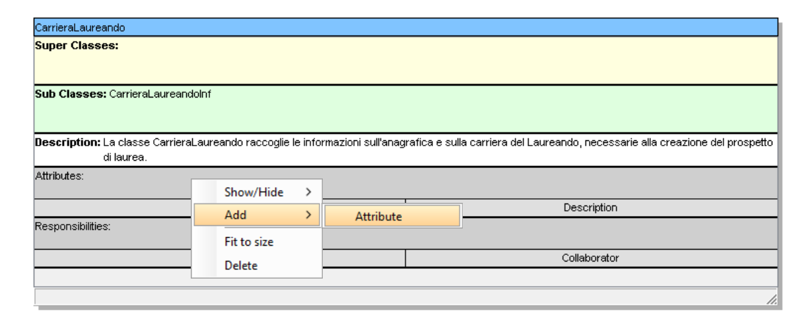
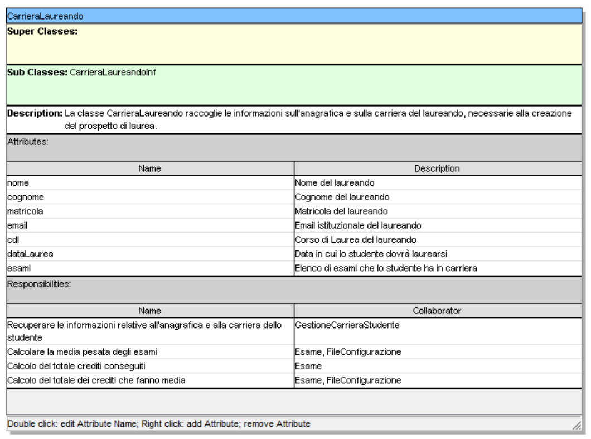
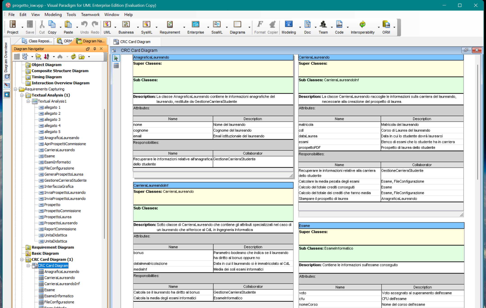
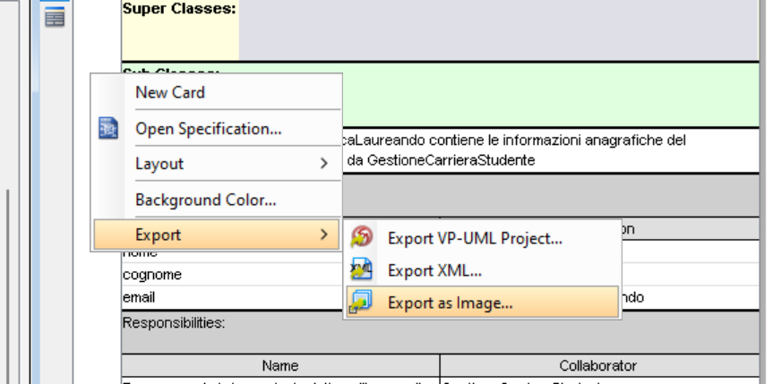
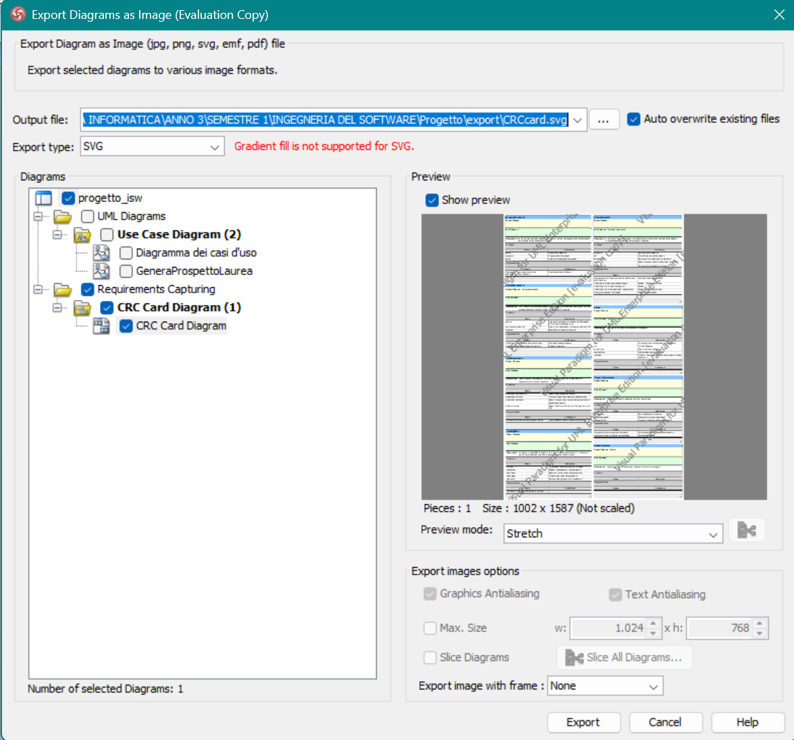
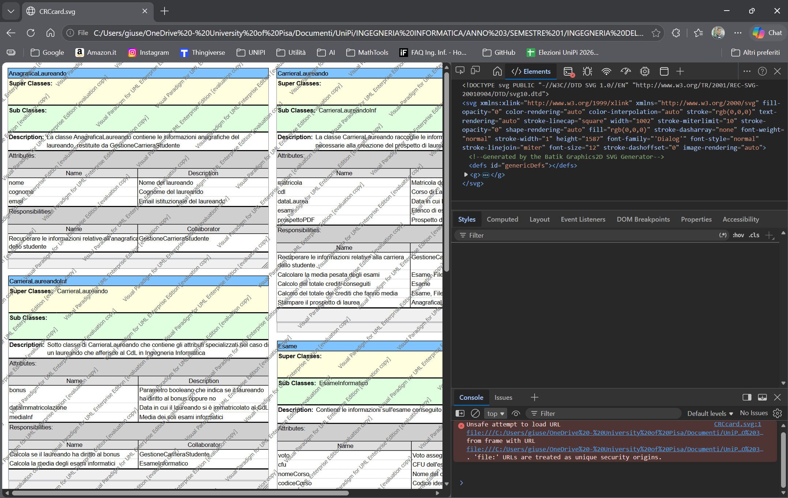
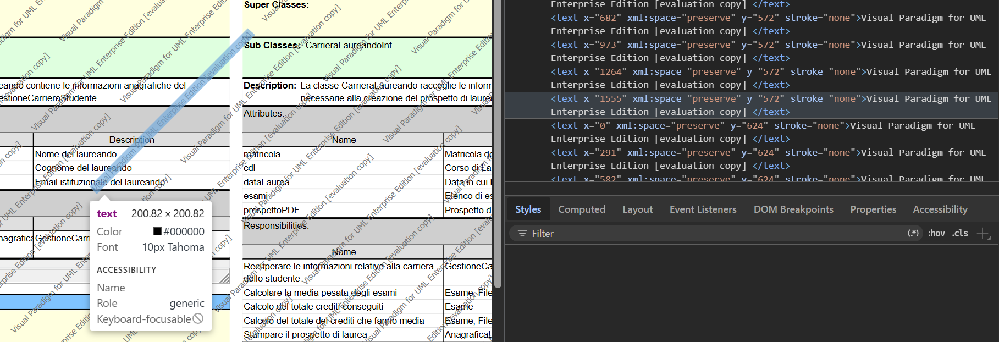
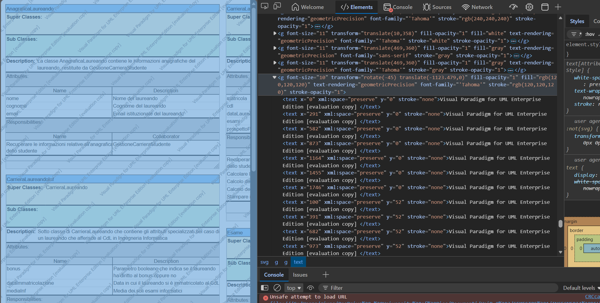

# 03 - CRC card

## Cenni di teoria per costruire le CRC card

Le schede CRC (Class, Responsibilities, Collaborators) sono uno strumento di brainstorming utilissimo durante la fase di *Analisi Orientata agli Oggetti*. Aiutano a capire quali classi servono al sistema, cosa devono fare e con chi devono interagire per farlo.

### Cosa contiene una CRC Card?

Una tipica scheda CRC è divisa in diverse sezioni:
1.  **Name (Nome della Classe)**: Sostantivo singolare.
2.  **Description (Descrizione)**: Breve spiegazione dello scopo della classe.
3.  **Attributes (Attributi)**: I dati che la classe deve "conoscere" o conservare al suo interno.
4.  **Responsibilities (Responsabilità)**: Cosa la classe sa fare (i verbi, le azioni).
5.  **Collaborators (Collaboratori)**: Altre classi a cui questa classe deve chiedere aiuto o informazioni per portare a termine le sue responsabilità.

## Prerequisiti

L’unico prerequisito è la stesura dei requisiti comprensiva di analisi testuale e individuazione di attori e casi d’uso

## Creazione delle CRC Card

1. Dal diagram navigator (se non è presente andare su View > Panes > Diagram Navigator) andare nella categoria Requirements Capturing, successivamente creiamo il diagramma contenente le CRC card, facendo tasto destro sulla voce CRC Card Diagram > New CRC Card Diagram

    

    Se si vuole si può rinominare il diagramma appena creato

2. Una volta creato e aperto il file avremo un foglio bianco al cui interno è possibile inserire tutte le card. Per farlo è sufficiente o fare tasto destro sul foglio e cliccare New Card, oppure cliccare sull'icona della card (icona sotto il puntatore verde in alto a sinistra) e poi con il mouse cliccare in un punto qualunque del foglio per inserire la card.

    

3. Adesso basterà aggiungere il contenuto alla CRC Card seguendo le indicazioni fornite nei cenni teorici qui sopra

## Esempio di CRC Card (CarrieraLaureando)

> **NOTA IMPORTANTE**: le CRC card andrebbero create in accordo con le classi candidate all'interno dell'analisi testuale. Non è detto che dobbiamo creare una CRC card per ogni classe candidata, ma laddove andiamo a svilupparne una quantomeno deve avere lo stesso nome.

1. **Nome della classe**: doppio click sul rettangolo azzurro con il nome della CRCCard > inserire il nome della classe che si vuole creare
    
     

    Nel mio caso la CRC card era per la classe CarrieraLaureando, che quindi sarà anche il nome della CRC card.

2. **Super Classes**: nell'esempio nessuno perché la classe CarrieraLaureando non è figlia di altre classi
3. **Sub Classes**: la classe CarrieraLaureando ha come sottoclasse derivata la classe CarrieraLaureandoInf (per il caso specifico di Ing. Informatica)
4. **Description**: "La classe CarrieraLaureando raccoglie le informazioni sull'anagrafica e sulla carriera del laureando, necessarie alla creazione del prospetto di laurea."
   
5. **Attributes**: per aggiungere un attributo (ovvero un'informazione che la classe conosce) composto dal suo nome e dalla sua descrizione, basta fare tasto destro nella casella grigia di "Attributes" > Add > Attribute

    

    | **Name** | **Description** |
    | --- | --- |
    | nome | Nome del laureando |
    | cognome | Cognome del laureando |
    | matricola | Matricola del laureando |
    | email | Email istituzionale del laureando |
    | cdl | Corso di Laurea del laureando |
    | dataLaurea | Data in cui lo studente dovrà laurearsi |
    | esami | Elenco di esami che lo studente ha in carriera |

6. **Responsibilities**: come per il punto 5 ci basta fare tasto destro sul riquadro grigio (stavolta su Responsibilities e non su Attributes) > Add > Responsibility. Così fatto, impostiamo il nome e la classe Collaborator

    | **Name** | **Collaborator** |
    | --- | --- |
    | Recuperare le informazioni relative all'anagrafica e alla carriera dello studente | GestioneCarrieraStudente |
    | Calcolare la media pesata degli esami | Esame, FileConfigurazione |
    | Calcolo del totale crediti conseguiti | Esame |
    | Calcolo del totale dei crediti che fanno media | Esame, FileConfigurazione |

> **RISULTATO FINALE**
> 

Dopo aver fatto ciò si ripete il procedimento per tutte le CRC card, andando a chiedersi ogni volta, che informazioni deve conoscere la classe e quali sono le sue funzioni principali.

Un piccolo trucco può essere quello di scrivere tutte le CRC card all'inizio e successivamente andarle a riempire.

> **NOTA BENE**  
> L'esempio mostrato è valido ai fini del tutorial, ma la CRC card **CarrieraLaureando** all'interno del progetto è stata poi modificata, dividendo l'anagagrafica dalla carriera, a causa del funzionamento delle richieste a GestioneCarrieraStudente.

## Esportazione delle CRC card

Dopo aver completato tutte le CRC card, sistemarle su visual paradigm andando a comporre quello che sarà il layout di esportazione. 

Dato che le CRC card saranno inserite all'interno del documento word condiviso con il professore, io ho sistemato le mie CRC card in un layout più o meno simile a quello di un foglio A4.

Per esportare le CRC card da Visual Paradigm accedere al file contenente le card che abbiamo già creato e sistemato in precedenza,



cliccare poi con il tasto destro su uno spazio vuoto sullo sfondo delle CRC card, cliccare su "Export", e poi su "Export as Image..."



Nella schermata che adesso compare, selezionare il tipo SVG e il percorso file.



Infine, cliccare su Export.

### Rimozione della filgrana

L'immagine SVG (immagine vettoriale) adesso esportata contiene una filgrana dovuta alla licenza del software. Qui è riportato un mini tutorial per rimuovere manualmente la filgrana:

> **NOTA BENE**  
> Il metodo a breve descritto ha funzionato nel mio caso, ma non riesco a garantire che funzioni in tutti i casi, pertanto prima di descrivere il metodo che ho usato nel mio caso, qui spiego in breve come riconoscere il blocco di testo da rimuovere e che contiene la filgrana.
>
> Per prima cosa apriamo l'immagine SVG con il browser (io uso Edge). Successivamente andare sullo strumento ispeziona del browser:
>
> 
>
> Da qui tramite il tastino per selezionare gli elementi dello strumento ispeziona, passiamo sopra un pezzo della filgrana finché non viene evidenziato il blocco che la contiene:
>
> 
>
> A questo punto il gioco è fatto perché tutta la filgrana è l'elenco contenuto in questo blocco:
>
> 
>
> Passando il mouse su `g font-size="10" transform="rotate(-45) translate(-1123.479,0)" ...` tutta la filgrana sarà evidenziata all'interno del browser, segno che abbiamo individuato il blocco esatto.

Quindi, nel mio caso (e spero sia così in generale), la filgrana avrà una forma di questo tipo:

```html
<g font-size="10" transform="rotate(-45) translate(-1123.479,0)" fill-opacity="1" fill="rgb(120,120,120)" text-rendering="geometricPrecision" font-family="&apos;Tahoma&apos;" stroke="rgb(120,120,120)" stroke-opacity="1"
    ><text x="0" xml:space="preserve" y="0" stroke="none"
      >Visual Paradigm for UML Enterprise Edition [evaluation copy] </text
      ><text x="291" xml:space="preserve" y="0" stroke="none"
      >Visual Paradigm for UML Enterprise Edition [evaluation copy] </text
      >
    ...
    ...
    ...
      ><text x="1455" xml:space="preserve" y="1768" stroke="none"
      >Visual Paradigm for UML Enterprise Edition [evaluation copy] </text
      ><text x="1746" xml:space="preserve" y="1768" stroke="none"
      >Visual Paradigm for UML Enterprise Edition [evaluation copy] </text
    ></g
    >
```

Dopo aver individuato il blocco di testo che contiene la filgrana è sufficiente riaprire il file svg con il blocco note e successivamente eliminarlo e salvare il file.

Adesso, riaprendo l'immagine, si potranno visualizzare le CRC card senza filgrana.
