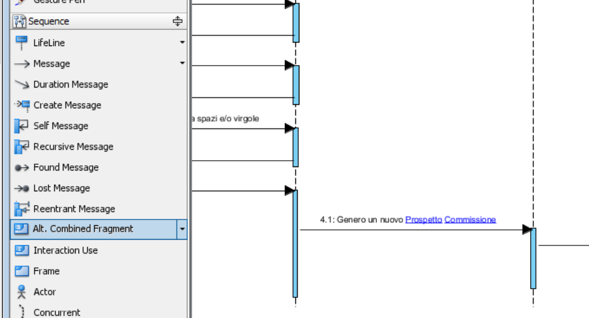
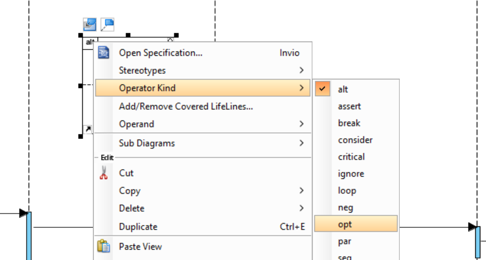

# 05 - Diagrammi di sequenza

> **NOTA PRELIMINARE**  
> Questo tutorial è principalmente basato sulle spiegazioni di Gemini, ed è stato successivamente revisionato.

## Cenni di Teoria

Un Diagramma di Sequenza descrive l'interazione tra gli oggetti in uno specifico scenario temporale. Si legge dall'alto verso il basso (il tempo scorre verso il basso).

### Come sono fatti i diagrammi di sequenza?

Ecco gli elementi fondamentali:

* **Attore (Actor)**: L'utente o il sistema esterno che avvia l'azione (es. Cliente).
* **Linea della Vita (Lifeline)**: È rappresentata da un rettangolo in alto (che contiene il nome dell'oggetto/classe) con una linea tratteggiata verticale che scende. Rappresenta l'esistenza dell'oggetto nel tempo.
* **Messaggi (Messages)**: Sono le frecce orizzontali scambiate tra le linee della vita. Nella programmazione reale, un messaggio equivale a chiamare un metodo (funzione) di un'altra classe.
    * **Messaggio Sincrono** (Freccia con punta piena): Il mittente aspetta una risposta prima di continuare (chiamata classica di funzione).
    * **Messaggio di Ritorno** (Freccia tratteggiata): Il risultato della funzione che torna al mittente.
* **Cilindro di Attivazione (Activation bar)**: Un rettangolo stretto e lungo sulla linea della vita che indica quando un oggetto è attivo o sta elaborando dei dati.
* **Frammenti Combinati (Combined Fragments)**: Delle "scatole" che racchiudono parte del diagramma per rappresentare logiche di programmazione:
    * **Alt (Alternative)**: Un blocco if/else (es. se la carta è valida fai X, altrimenti fai Y).
    * **Loop**: Un ciclo (es. ripeti per ogni articolo nel carrello).
    * **Opt (Optional)**: Un blocco if senza l'else (es. applica lo sconto solo se presente).

## Prerequisiti

1. Aver completato la stesura dettagliata dei casi d'uso
2. Aver creato tutte le classi del progetto (quelle che abbiamo usato nel diagramma di classe)

## Realizzazione dei diagrammi di sequenza

Il modo migliore per lavorare in Visual Paradigm è collegare logicamente il Diagramma di Sequenza al Caso d'Uso che sta descrivendo.

### Step 1: Creare il Diagramma (Metodo Consigliato)
Se hai già disegnato un Diagramma dei Casi d'Uso (Use Case Diagram):

Apri il tuo Diagramma dei Casi d'Uso.

Fai clic destro sull'ovale del Caso d'Uso che vuoi descrivere (es. "Effettua Ordine").

Seleziona Sub Diagrams > New Diagram...

Scegli Sequence Diagram e clicca su Next/OK.
*Perché farlo così? In questo modo VP capisce che questa sequenza è la spiegazione dettagliata di quel preciso caso d'uso, mantenendo il progetto ordinato e navigabile.*

(Alternativa manuale: Diagram > New > Sequence Diagram).

### Step 2: Inserire gli Attori e gli Oggetti (Lifelines)
Apri il Model Explorer a sinistra.

Cerca l'Attore che inizia l'azione e trascinalo nel foglio. Apparirà in alto a sinistra con la sua linea tratteggiata.

Ora cerca le Classi che hai creato nel diagramma precedente. Trascina le classi coinvolte in questo scenario e rilasciale accanto all'attore.

**Nota bene**: quando trascini una classe (es. Carrello), VP crea una Lifeline che rappresenta un'istanza di quella classe (un oggetto specifico).

### Step 3: Disegnare i Messaggi (Le chiamate ai Metodi)
Ora devi far "parlare" gli oggetti usando il Resource Catalog.

Clicca sulla linea della vita dell'Attore (o sul cilindro di attivazione).

Apparirà l'iconcina del Resource Catalog (la freccina vicino all'elemento).

Clicca, tieni premuto e trascina la freccia verso la linea della vita di destinazione (es. l'oggetto InterfacciaUtente o Carrello).

Rilascia il mouse e scegli Message (il primo della lista, freccia piena).

Il trucco fondamentale di VP: Quando digiti il nome del messaggio, VP andrà a leggere il Diagramma delle Classi! Se stai mandando un messaggio alla classe Carrello, ti proporrà un menu a tendina con le Operazioni (metodi) che avevi già assegnato a quella classe. Scegli l'operazione corretta.

### Step 4: Aggiungere le Risposte (Return Messages)
Per mostrare il risultato di un'operazione, fai la stessa cosa al contrario: trascina dal Resource Catalog dell'oggetto ricevente verso il mittente.

Nel menu pop-up, scegli Return Message (sarà automaticamente tratteggiato).

Scrivi cosa viene restituito (es. totaleDaPagare o conferma).

### Step 5: Aggiungere Logica (Frammenti Alt o Loop) - Se necessario
Se il tuo caso d'uso prevede una scelta (es. pagamento accettato o rifiutato):

Vai nella Diagram Toolbar a sinistra e cerca l'icona Combined Fragment (o Alt/Loop).

Cliccaci e poi disegna un rettangolo nel diagramma che racchiuda i messaggi coinvolti nella scelta.

Nell'angolo in alto a sinistra del rettangolo comparirà un'etichetta (di default potrebbe dire seq o alt). Cliccaci con il tasto destro per cambiarla in Alt (per if/else), Opt (opzionale) o Loop.

Se usi "Alt", apparirà una linea orizzontale tratteggiata per separare la condizione "Vero" (in alto) dalla condizione "Falso" (in basso). Fai doppio clic sulle condizioni tra parentesi quadre [ ] per scriverle (es. [saldo sufficiente] e [saldo insufficiente]).

## Esportazione dei diagrammi di sequenza

La procedura per l'esportazione e la rimozione della filgrana dai diagrammi di sequenza è del tutto equivalente a quella mostrata nel [Tutorial sulle CRC card](03%20-%20CRC%20card.md#esportazione-delle-crc-card).