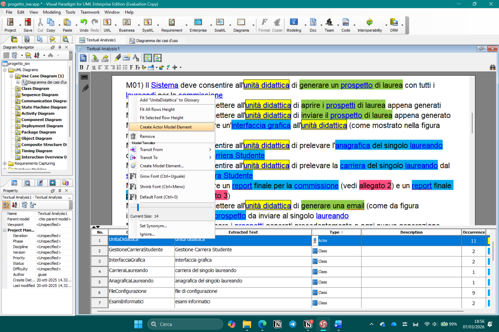
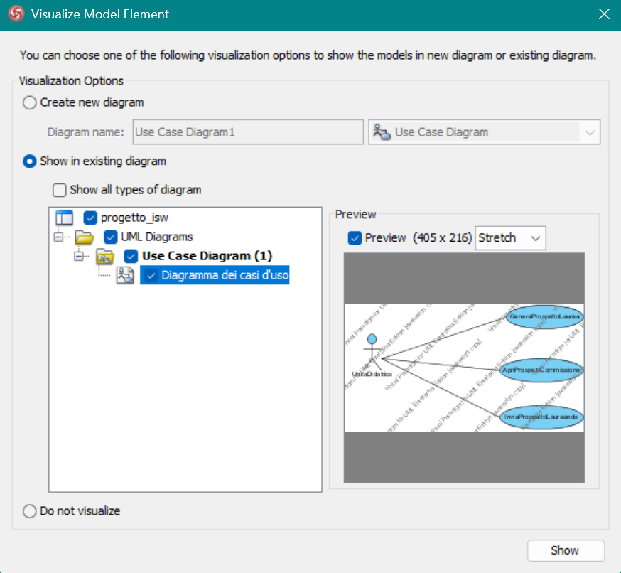
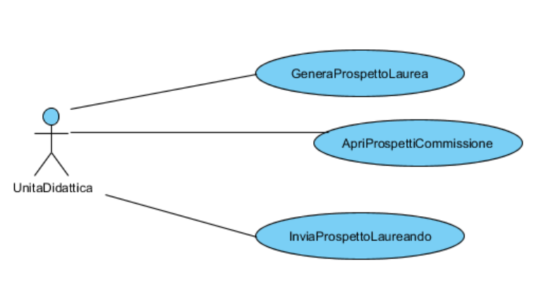
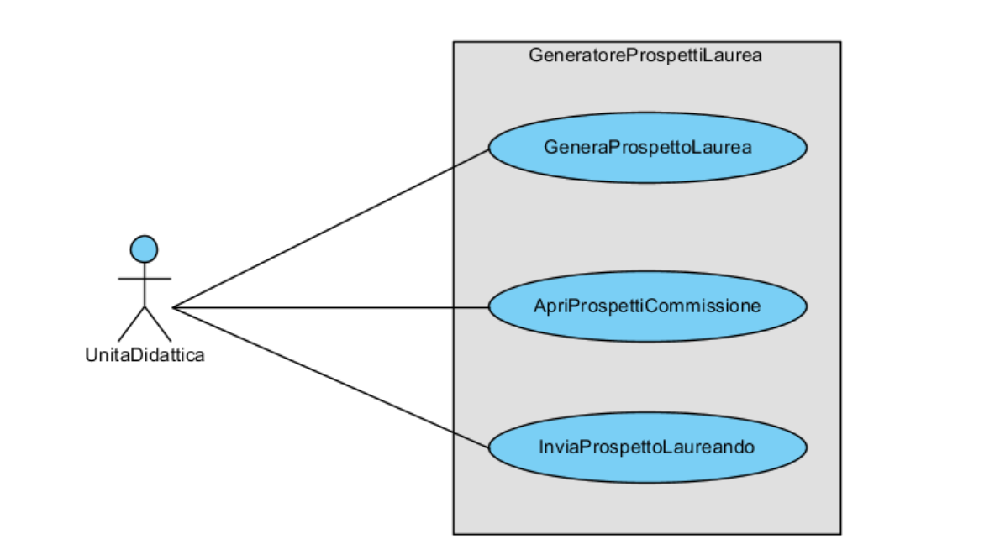

# Diagramma dei casi d’uso

## Prerequisiti

L’unico prerequisito è la stesura dei requisiti comprensiva di analisi testuale e individuazione di attori e casi d’uso

## Tutorial semplice per creare il diagramma dei casi d’uso

1. Nella sezione Diagram Navigator a sinistra andare su UML Diagrams → Use Case Diagram → New Use Case Diagram → Scegliere un nome (nel mio caso “Diagramma dei casi d’uso”)

Tornare adesso nel file di Textual Analysis e nella sezione in basso:

1. Selezionare l’attore Unità Didattica → tasto destro → Create Actor Model Element
    
    
    
    Successivamente aggiungiamo l’elemento creato al diagramma dei casi d’uso
    
    
    
2. Ripetiamo lo stesso procedimento per i nostri 3 casi d’uso

Adesso avremo ottenuto un diagramma con un attore e 3 casi d’uso, dobbiamo creare delle associazioni tra il nostro attore e i diagrammi dei casi d’uso

1. Cliccare sull’attore → primo simbolino (Association - > Use Case) → trascinare l’elemento fino ad evidenziare il caso d’uso
    
    
    

Nota bene: per rendere il diagramma più carino e fatto bene si possono:

1. sistemare le associazioni spostando i due estremi delle rette e cliccando la graffetta verde per vincolare la retta
2. aggiungere l’elemento “system” dal listato a sinistra nella pagina del diagramma dei casi d’uso e rinominarlo come “GeneratoreProspettiLaurea” (arbitrario)
3. aggiustare colori, dimensioni e stile

Alla fine il risultato che si ottiene è il seguente:

