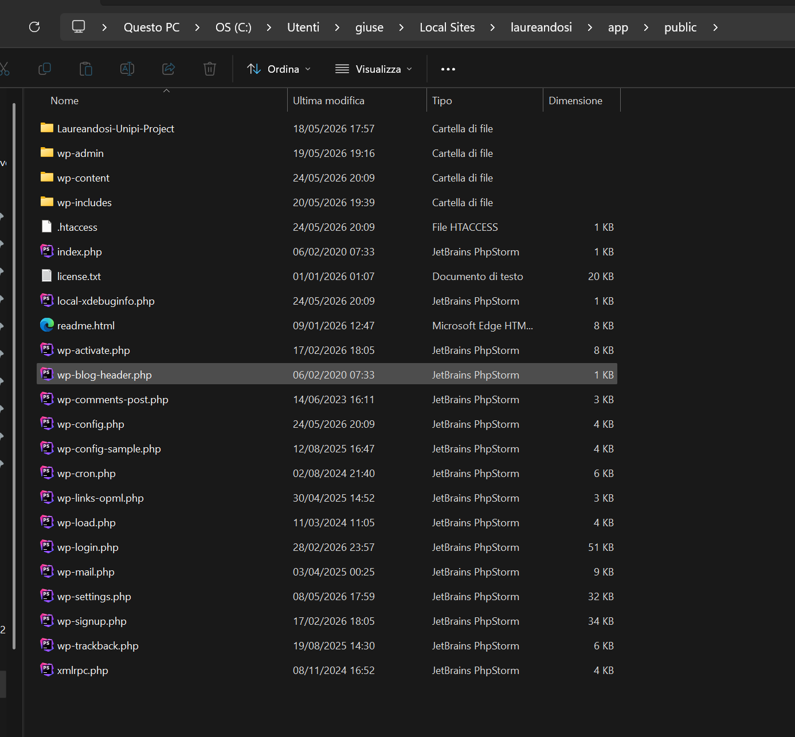
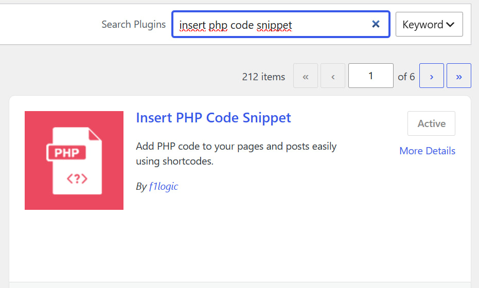
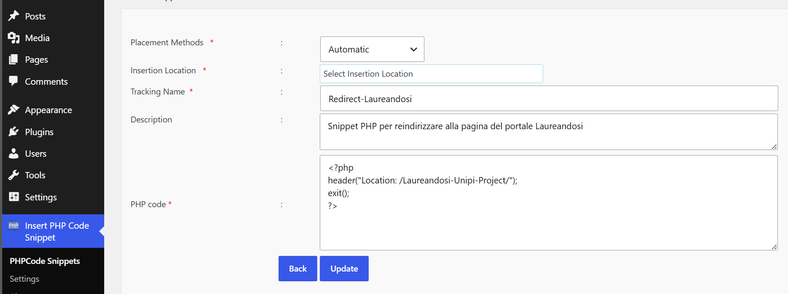
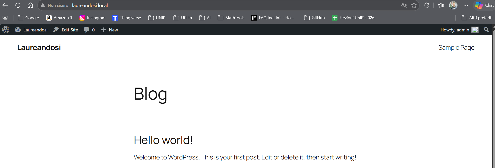
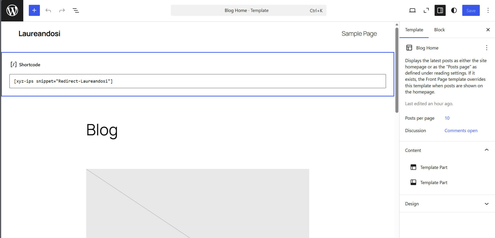
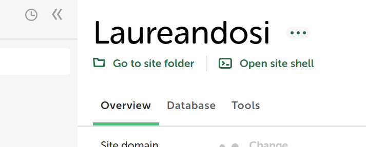
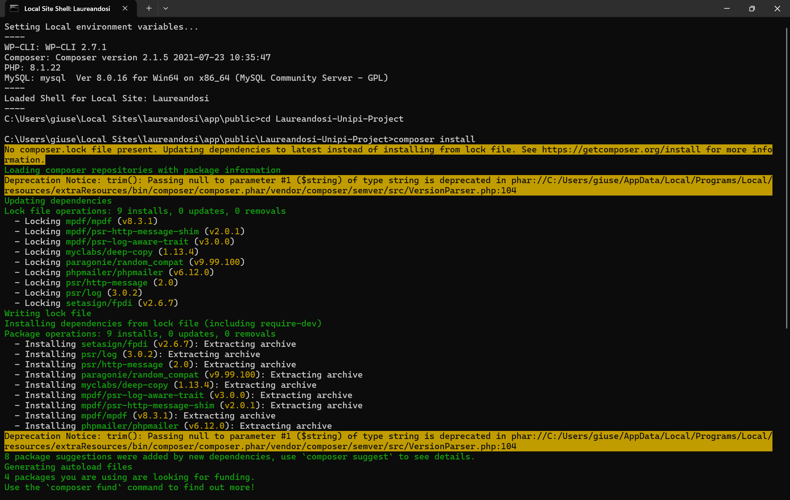
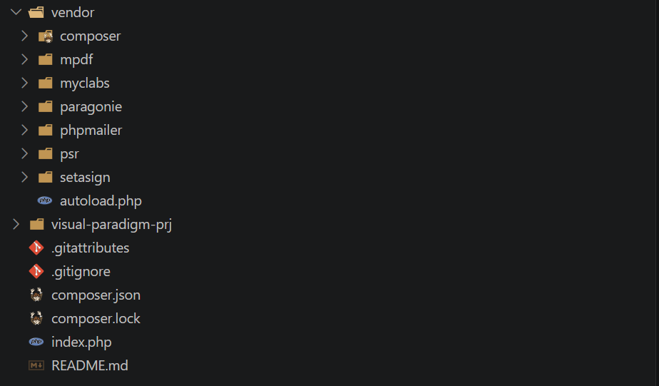
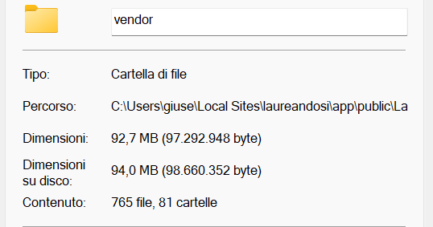
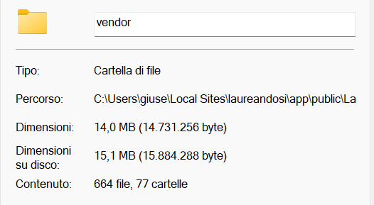

# 1. Creazione iniziale del sito

- [1. Creazione iniziale del sito](#1-creazione-iniziale-del-sito)
  - [Consigli fondamentali prima di iniziare](#consigli-fondamentali-prima-di-iniziare)
  - [Fase 1: Preparare il Server Locale](#fase-1-preparare-il-server-locale)
  - [Fase 2: Configurare PhpStorm (Regole PSR-12)](#fase-2-configurare-phpstorm-regole-psr-12)
  - [Fase 3: Creazione della pagina principale e reindirizzamento con snippet PHP](#fase-3-creazione-della-pagina-principale-e-reindirizzamento-con-snippet-php)
    - [Snippet PHP](#snippet-php)
    - [Come testare il sito](#come-testare-il-sito)
  - [Fase 4: Configurazione delle Librerie](#fase-4-configurazione-delle-librerie)
    - [Pulizia delle librerie per ridimensionare la cartella](#pulizia-delle-librerie-per-ridimensionare-la-cartella)
  - [Considerazioni finali](#considerazioni-finali)


Questa guida è stata pensata per tutti gli studenti che si approcciano per la prima volta allo sviluppo web in PHP per l'esame di Ingegneria del Software. Io personalmente non ho mai messo mano a un sito web (e non ho mai seguito ancora nemmeno progettazione web) e ho avuto parecchia difficoltà a capire anche solo come andassero organizzati i file, o come fare per avere un sito web e accedere alla sua pagina principale. Cosa non banale: **la guida avrà anche lo scopo di rendere il sito web portabile** in modo tale da creare una cartella in formato zip da poter inviare al professore.

In questo documento sono inclusi anche **i migliori suggerimenti dei colleghi che hanno già affrontato ISW** (*e per cui ringrazio in particolare i colleghi Cambria e Calvani*) in merito a questa prima parte di **Implementazione & Design** in cui creiamo e configuriamo il sito che ospiterà il portale Laureandosi.

## Consigli fondamentali prima di iniziare

Il laboratorio ufficiale mostra un'integrazione di PHP all'interno dei template di WordPress e il copia-incolla manuale di un'enorme cartella `lib`. Tuttavia, i progetti con i voti più alti usano un approccio diverso, preferito dal docente stesso in fase di revisione e consegna:

1. **Nessun WordPress**: WordPress porta con sé migliaia di file di sistema che ingombrano il progetto. Lavorando "stand-alone" scriveremo solo codice HTML, CSS e PHP puro, mantenendo totale controllo sull'interfaccia. Inoltre, questo è l'approccio che storicamente il professore preferisce.
2. **Uso di Composer (Addio cartella `lib`)**: La cartella `lib` fornita nel laboratorio è pesantissima (contiene font esotici, localizzazioni in arabo/cinese, e manuali inutili). Questo **fa superare facilmente il limite di dimensione dello ZIP da consegnare**. Usando `Composer`, scarichiamo solo il "motore" essenziale delle librerie.
3. **Portabilità Assoluta**: Il progetto risiede in una singola cartella indipendente. Il professore potrà estrarre il vostro ZIP, metterlo su *qualsiasi* server Apache/PHP e il simulatore funzionerà istantaneamente. Per esempio nel nostro caso con Local basterà creare un sito di prova su Local, andare nella sua cartella in `C:\Users\<nome_utente>\Local Sites\prova\app\public` e qui dentro estrarre e incollare il contenuto dello zip; seguendo poi il manuale di installazione contenuto nella documentazione sarà facilmente possibile utilizzare il sito.

## Fase 1: Preparare il Server Locale

Per far girare il codice PHP, dobbiamo creare un ambiente server sul computer. Continueremo a usare **Local by Flywheel**, ma in modo molto più furbo.

1. Apri **Local** e clicca sul pulsante **"+" (Add Local Site)** per creare un nuovo ambiente.
2. Chiamalo come preferisci (nel mio caso il nome del sito è `laureandosi`) e scegli l'impostazione predefinita per l'ambiente (come mostrato sul tutorial delle slide di laboratorio).
3. Local ti obbligherà a creare un utente per WordPress: inserisci dati casuali (es. come suggerito dal prof `admin`/`admin`).
4. **Il passaggio chiave:** Una volta avviato il sito, clicca su **"Go to site folder"** (sotto il nome del sito in Local).
5. Naviga nel percorso `app` > `public`.
6. **Crea qui la tua cartella di progetto**: Clicca col tasto destro e crea qui la cartella del progetto (nel mio caso si chiama `Laureandosi-Unipi-Project`). Questa sarà la cartella che zipperemo e manderemo al professore, pertanto conterrà anche il progetto visual paradigm e la documentazione. Se come nel mio caso avevate già creato la cartella contenente tutti i file in un'altra posizione basterà spostarla all'interno della cartella `public`.
   

> **NOTA BENE:**  
> Da questo momento in poi dobbiamo lavorare solo all'interno della cartella creata (`Laureandosi-Unipi-Project`). Il professore riceverà questa cartella e se ci sono file esterni (per esempio file php) il professore **non potrà testare il vostro sito**. Tutta la procedura di installazione e portabilità sarà descritta nel **manuale di installazione** (attualmente non presente tra i tutorial ma arriverà a tempo debito).

## Fase 2: Configurare PhpStorm (Regole PSR-12)

> **Disclaimer:** la parte sullo standard PSR-12 è stata trascritta dalle slide di laboratorio da Gemini e non è stata revisionata da me. Io personalmente avevo seguito le slide ma penso sia equivalente. 

Il professore esige che il codice sia scritto secondo lo standard PSR-12 (che detta regole su spazi, tabulazioni e formattazione).

1. Apri **PhpStorm** e clicca su **Open**.
2. **ATTENZIONE:** Non aprire l'intera cartella `public`! Seleziona e apri **solo** la tua cartella `Laureandosi-Unipi-Project`. Questo manterrà l'IDE pulito dai file di WordPress. Se non ti viene mostrata la cartella del tuo sito fai più tentativi, nel mio caso è stato sufficiente riprovare più volte e refreshare.
3. Attiva lo standard PSR-12:
   * Vai in `File` > `Settings` (o premi `Ctrl+Alt+S`).
   * Naviga in `Editor` > `Code Style` > `PHP`.
   * Clicca in alto a destra su **Set from...** e seleziona **PSR12**. Clicca su *Apply* e *OK*.

## Fase 3: Creazione della pagina principale e reindirizzamento con snippet PHP

La pagina principale sarà fisicamente raggiungibile tramite il file `index.php` che creeremo all'interno della nostra cartella di progetto, pertanto la prima cosa da fare è:

1. In PhpStorm, fai clic destro sulla cartella radice del progetto (la cartella `Laureandosi-Unipi-Project`) $\rightarrow$ `New` $\rightarrow$ `PHP File`.
2. Assegna al file il nome `index.php`. Da questo momento in poi in questa pagina ci sarà la nostra home per il portale laureandosi.

> **Come testare il sito:** Da questo momento, potrai vedere il tuo progetto semplicemente avviando il sito da local e digitando nel browser: **`http://<nome_sito_local>.local/<nome_cartella_dentro_public>/`** (nel mio caso`http://laureandosi.local/Laureandosi-Unipi-Project/`).

### Snippet PHP

Quello che adesso faremo è semplificare l'accesso alla home page, in particolare vogliamo evitare di scrivere tutto l'URL e accedere semplicemente digitando `http://laureandosi.local/`. Se digitiamo questo indirizzo in questa prima fase ci porterà alla home page del nostro sito realizzata in WordPress e predefinita. Per reindirizzare l'utente verso la home page dobbiamo seguire questi passaggi:

1. Accedi alla bacheca di amministrazione di WordPress cliccando su WP Admin all'interno dell'interfaccia di Local.
2. Vai nel menu Plugins $\rightarrow$ Add New (Aggiungi nuovo).
3. Cerca il plugin "Insert PHP Code Snippet" (sviluppato da xyzscripts.com), clicca su Install Now e successivamente su Activate.
   
4. Nel menu laterale di WordPress comparirà la nuova voce XYZ PHP Code. Cliccaci sopra e seleziona PHPCode Snippets, poi clicca in alto su Add New PHP Code Snippet.
5. Configura lo snippet inserendo questi parametri:
    * Tracking Name: Redirect-Laureandosi (o quello che preferisci)
    * PHP code: 
        ```php
        <?php
        header("Location: /Laureandosi-Unipi-Project/");
        exit();
        ?>
        ```
    
6. Clicca su Create. Verrai reindirizzato alla tabella riassuntiva degli snippet.
7. Individua la riga dello snippet appena creato e, sotto la colonna Snippet Short Code, copia l'intero testo comprensivo di parentesi quadre (sarà simile a: **`[xyz-ips snippet="Redirect-Laureandosi"]`**). Nel mio caso la colonna Snippet Short Code non appariva pertanto ho sostituito il testo tra virgolette con il nome dello snippet appena creato.
8. Vai nella sezione Pages (Pagine) di WordPress e apri la pagina principale del tuo portale (la Main Page o Homepage).
    > Nel mio caso non sono riuscito a trovare la main page all'interno di pages ma ho risolto molto semplicemente in quanto con la pagina di wordpress ancora aperta sono andato all'indirizzo del mio sito (laureandosi.local) e in alto ho cliccato su **Edit Site**, da li ho proseguito con i punti successivi.
     
9. All'interno dell'editor grafico a blocchi, aggiungi un blocco di tipo "Shortcode" posizionandolo in cima alla pagina.
10. Incolla il codice precedentemente copiato all'interno del blocco Shortcode e clicca su Update (Aggiorna) in alto a destra.
    

### Come testare il sito

> **Come testare il sito:** Da questo momento, potrai vedere il tuo progetto semplicemente avviando il sito da local e digitando nel browser: **`http://<nome_sito_local>.local`** (nel mio caso`http://laureandosi.local`).
   
## Fase 4: Configurazione delle Librerie

Invece di copiare manualmente la pesante cartella `lib` fornita a lezione (piena di file di localizzazione inutilizzati e documentazione che appesantisce lo ZIP di consegna), utilizzeremo **Composer** per scaricare solo i file core di *PHPMailer* e *mPDF*.

1. In PhpStorm, fai clic destro sulla cartella radice del progetto (la cartella `Laureandosi-Unipi-Project`) $\rightarrow$ `New` $\rightarrow$ `File`.
2. Assegna al file il nome `composer.json` e incolla al suo interno il seguente codice di configurazione:

```json
{
    "name": "<nome_autore>/laureandosi-project",
    "type": "project",
    "require": {
        "php": "^8.1",
        "phpmailer/phpmailer": "^6.8",
        "mpdf/mpdf": "^8.1"
    },
    "config": {
        "platform": {
            "php" : "8.1.22",
            "ext-gd": "1"
        }
    },
    "autoload": {
        "psr-4": {
            "Laureandosi\\": "src/"
        }
    }
}
```

Per installare le librerie:

1. Procediamo adesso aprendo local e andando sul nostro sito, qui clicchiamo su **Open site shell**
    
2. Qui digitiamo i seguenti comandi:
    ```bash
    cd Laureandosi-Unipi-Project
    composer install
    ```
    

3. Il progetto inzierà a prendere questa forma:
    

### Pulizia delle librerie per ridimensionare la cartella

> **Questo passaggio può anche essere fatto alla fine del progetto, prima della consegna**

> **ATTENZIONE:** tutto quello che si è fatto fino ad ora è giusto, ma dato che la cartella che va poi esportata ha una dimensione limitata dobbiamo adesso rimuovere alcuni file in eccesso che appesantiscono la cartella e sono a noi inutili. I file che rimuoverò e che sono elencati qui sotto me li ha suggeriti il collega Cambria (*che ringrazio di nuovo*), ma allo stato attuale non so dire se questa soluzione aggira i limiti di peso, pertanto aggiornerò questo commento solo alla fine del progetto e alla sua consegna, aggiungendo eventualmente altri file da rimuovere.

Per la pulizia dei file io ho fatto riferimento a tutti i file eliminati in [**questo commit**](https://github.com/Gabriele-D-Cambria/Laureandosi-a-isw-project/commit/6a226b609eaf42352521ded629ca9fa434d6c3b8), eliminando solo i file in comune con il collega Cambria, cercando di mantenere un approccio più sicuro possibile

Alla fine di questa pulizia la mia cartella è passata da questa situazione iniziale:



a questa situazione finale:



Questo mi ha soddisfatto in quanto confrontando il peso della cartella vendor del collega Cambria con il peso della mia cartella vendor, le due dimensioni erano molto simili, pertanto mi sono fermato.

## Considerazioni finali

Arrivati a questo punto lo scheletro del notro sito è stato creato

Arrivati a questo punto abbiamo terminato la creazione del sito web dedicato al portale Laureandosi. Se abbiamo seguito bene tutti i passaggi precedenti, la nostra cartella avrà una struttura di questo tipo:

```text
Laureandosi-Unipi-Project/
│
├── le_tue_cartelle_del_progetto/   # [CARTELLA] (libero arbitrio su come organizzarla)
│
├── vendor/                         # [CARTELLA AUTOGENERATA DA COMPOSER]
|   ├── [serie di librerie]         # [CARTELLE CON LE LIBRERIE INSTALLATE DA COMPOSER]        
│   └── autoload.php                # Script che "carica" automaticamente PHPMailer e mPDF
│
├── composer.json                   # Le istruzioni per Composer
├── composer.lock                   # File generato da composer install
└── index.php                       # La pagina grafica del Simulatore (Front-End), oltre che homepage di laureandosi
```

A questo scheletro andrebbero aggiunte all'interno della root (cartella del progetto, ovvero Laureandosi-Unipi-Project) una cartella `css` che contiene i fogli di stile del sito come `stile.css`, e in più manca tutta la logica di back-end che andrà implementata per esempio in un file `elabora.php`. Tutto questo può essere riassunto dal seguente esempio:

```text
Laureandosi-Unipi-Project/
│
├── le_tue_cartelle_del_progetto/   # [CARTELLA] (libero arbitrio su come organizzarla)
│
├── css/                            # [CARTELLA]
│   └── stile.css                   # L'estetica della tua interfaccia (colori, margini, ecc.)
│
├── vendor/                         # [CARTELLA AUTOGENERATA DA COMPOSER]
|   ├── [serie di librerie]         # [CARTELLE CON LE LIBRERIE INSTALLATE DA COMPOSER]        
│   └── autoload.php                # Script che "carica" automaticamente PHPMailer e mPDF
│
├── composer.json                   # Le istruzioni per Composer
├── composer.lock                   # File generato da composer install
├── index.php                       # La pagina grafica del Simulatore (Front-End), oltre che homepage di laureandosi
└── elabora.php                     # Il cuore logico del progetto (Back-End)
```

Ribadisco, questo è solo un esempio che verrà raffinato nei tutorial successivi.